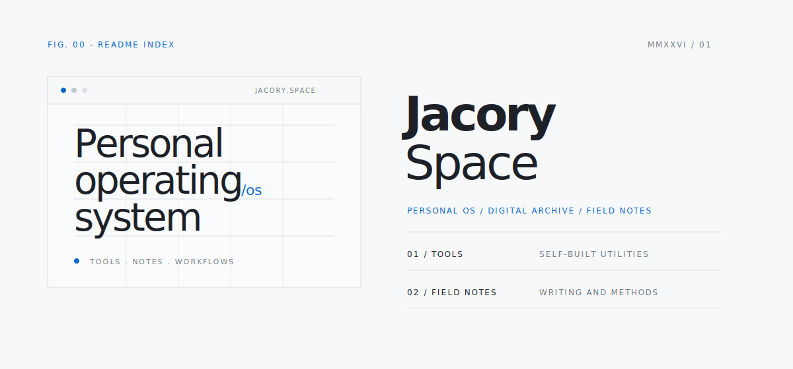

  

# Jacory Space

`PERSONAL OS / DIGITAL ARCHIVE / FIELD NOTES`

Jacory Space is my personal digital space for tools, notes, creative work, and agent workflows.
It is built as a long-term personal operating system rather than a conventional homepage.

---

## 01 / System

Jacory Space organizes the things I build and think through:
interfaces, writing, local tools, video workflows, knowledge archives, and reusable agent assets.

The visual language is quiet and technical: cool white surfaces, ink-like text, hairline structure,
small mono labels, sparse blue accents, and an editorial archive rhythm.

## 02 / Index

| Surface | Role |
| --- | --- |
| `Tools` | Self-built utilities, interface experiments, and project entries |
| `Field Notes` | Essays, project notes, methods, reviews, and observations |
| `Video Parser` | A local workflow for parsing videos and shaping structured notes |
| `Agent Library` | Skills, rules, prompts, and personal AI workflow assets |

## 03 / Direction

`WEB EXPERIENCE DESIGN` . `SOFTWARE DEVELOPMENT` . `AGENT SYSTEMS` . `VIDEO CREATION` . `KNOWLEDGE ARCHIVES`

## 04 / Status

This space is in public construction.
The system will keep evolving as the tools, notes, and workflows become more precise.
