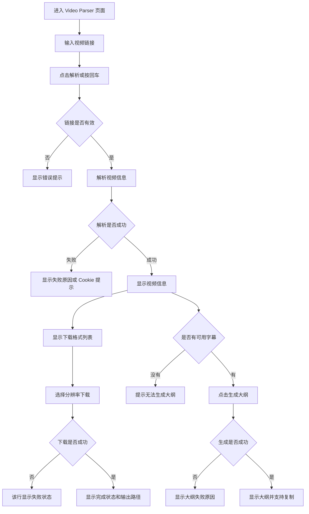
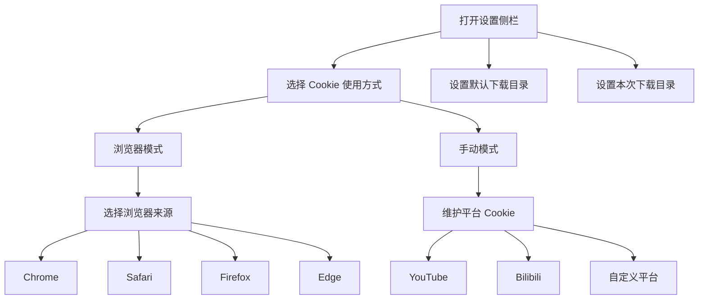

# Video Parser 功能介绍

Video Parser 是 Jacory Space 里的视频解析和下载工具。它面向的是一个很直接的使用场景：输入视频链接，解析出视频信息和可下载格式，然后选择需要的清晰度下载到本地；如果视频有可用字幕，还可以基于字幕生成内容大纲。

这份文档只描述用户能看到的功能流程，不展开具体代码实现。

## 功能定位

Video Parser 主要解决三件事：

- 解析视频链接，展示标题、封面、时长、平台等基础信息。
- 列出可下载格式，让用户按分辨率选择下载。
- 在存在字幕时生成视频大纲，帮助快速理解内容结构。

它不是云端网盘，也不是公开视频库。当前设计更偏向个人本地工具：前端页面负责输入、展示和操作，后端负责调用解析能力、处理 Cookie、执行下载和保存文件。

## 用户可见流程

## 页面模块

### 01. Command

用户输入视频链接的主入口。这里负责接收链接、触发解析，并在链接格式明显不对时给出提示。

### 02. Status

展示当前解析或下载状态。比如正在解析、解析失败、正在下载、下载完成等。

### 03. Video Info

解析成功后展示视频基础信息，包括标题、封面、平台、时长等。用户先确认视频是不是目标内容，再继续下载或生成大纲。

### 04. Download Registry

展示可下载格式列表。左侧以分辨率作为主要选择信息，右侧保留格式类型等必要信息，避免重复展示同一层级的分辨率信息。

### 05. Outline Map

当视频存在可用字幕时，可以生成内容大纲。大纲用于快速理解视频结构，不等于完整字幕转写。

### 06. Output Path

展示当前下载输出位置。默认下载目录可以在设置里修改，本次下载也可以选择单独的输出目录。

## Cookie 设置

部分平台或视频需要登录态才能解析。Cookie 设置用于解决这类受限视频的访问问题。

默认更推荐浏览器模式。它让后端从本机浏览器读取 Cookie，减少手动复制 Cookie 的成本。手动模式适合浏览器读取失败，或者需要为某个平台单独维护 Cookie 的情况。

## 当前边界

- 下载发生在本地后端所在机器，不是 Cloudflare 前端直接执行下载。
- 后端需要可用的 `yt-dlp`，视频合并场景建议安装 `ffmpeg`。
- 受限视频能否解析，取决于平台限制、Cookie 可用性和本地环境权限。
- 大纲生成依赖字幕；没有字幕时只能下载，不能可靠生成大纲。
- 当前更适合个人使用，不适合直接开放成公共下载服务。
